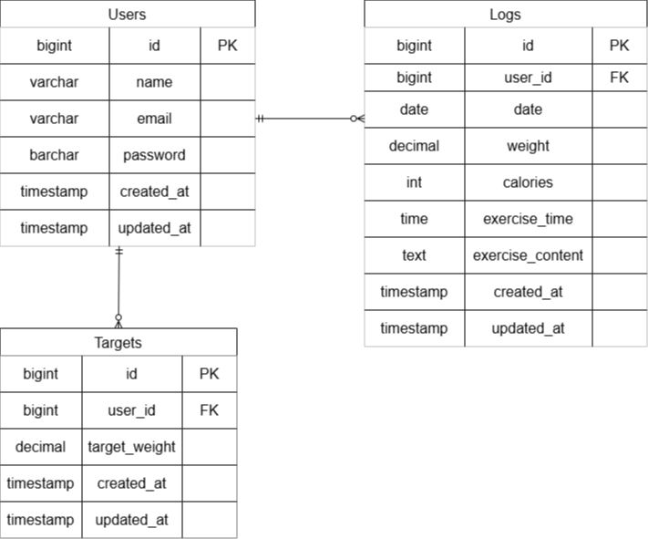

# PiGry

## 環境構築
git clone git@github.com:2n4p/Pigry.git  
cd Pigry

### 依存関係のインストール
docker run --rm \
    -u "$(id -u):$(id -g)" \
    -v "$(pwd):/var/www/html" \
    -w /var/www/html \
    -e COMPOSER_CACHE_DIR=/tmp/composer_cache \
    laravelsail/php82-composer:latest \
    composer install

### 環境ファイル作成
cp .env.example .env

### エイリアス設定
- Zsh（Mac）の場合 
echo "alias sail='[ -f sail ] && bash sail || bash vendor/bin/sail'" >> ~/.zshrc
exec $SHELL

- Bash（Linux）の場合 
echo "alias sail='[ -f sail ] && bash sail || bash vendor/bin/sail'" >> ~/.bashrc
exec $SHELL

### Sailの起動
sail up -d

### アプリケーションキーの生成
sail artisan key:generate

### マイグレーション・シーダーの実行
sail artisan migrate --seed

## 使用技術
- Sail 8.5
- MySQL 8.4

## ER図

## URL
- ログイン
http://localhost
- ユーザー登録
http://localhost/register/step1